<h1 align="center">Krishna Kant Singh</h1>

  

  &nbsp;
  &nbsp;
  

  

## Currently

- **Building** [`friday`](https://github.com/devkkxingh/friday) — a macOS automation agent driven over WhatsApp, on the Claude Agent SDK
- **Shipping** [`krenk`](https://www.npmjs.com/package/krenk) — a multi-agent software-engineering CLI, published on npm
- **Exploring** AI-driven product features with the OpenAI and Anthropic APIs
- **Open to** conversations on frontend architecture, design systems, and applied AI

---

## Tech Stack

**Frontend**

      

**Backend**

     

**AI / ML**

    

**Tools**

   

---

## Selected Work

> **[friday](https://github.com/devkkxingh/friday)** &nbsp;&middot;&nbsp; `Latest` 
> A personal automation agent for macOS, controlled entirely through WhatsApp — runs shell and native macOS automation, drives a real Chrome profile, and handles two-way voice notes. Built on the Claude Agent SDK. 
> `TypeScript` &nbsp; `Claude Agent SDK` &nbsp; `macOS` &nbsp; `Automation`

> **[krenk](https://github.com/devkkxingh/krenk)** &nbsp;&middot;&nbsp; [npm ↗](https://www.npmjs.com/package/krenk) 
> A multi-agent software-engineering CLI that orchestrates a team of specialized AI agents — from planning to deployment — assigning the right job to the right agent, like a real engineering team. 
> `TypeScript` &nbsp; `Multi-Agent` &nbsp; `Claude` &nbsp; `CLI`

> **[SnapYour.Codes](https://github.com/devkkxingh/snapyour.codes)** &nbsp;&middot;&nbsp; [Live ↗](https://snapyour-codes.vercel.app) 
> A polished code-snippet screenshot generator for capturing, customizing, and exporting beautiful code images with configurable themes and a responsive UI. 
> `React` &nbsp; `Redux` &nbsp; `Tailwind CSS` &nbsp; `Radix UI`

> **[Lavio-AI](https://github.com/devkkxingh/Lavio-AI)** 
> Real-time voice conversations with AI for enhanced web browsing and productivity, powered by Chrome's built-in AI. 
> `JavaScript` &nbsp; `Chrome Extension` &nbsp; `Built-in AI` &nbsp; `Voice`

> **[Shopify Next.js Integration](https://github.com/devkkxingh/shopify-nextjs-external)** 
> A secure, enterprise-grade Next.js app for Shopify store integration — OAuth authentication, JWT session management, and encrypted token storage. 
> `Next.js 15` &nbsp; `TypeScript` &nbsp; `Shopify API` &nbsp; `OAuth`

> **[fetch-reactive](https://github.com/devkkxingh/fetch-reactive)** 
> A zero-dependency reactive fetch wrapper for JavaScript and TypeScript. 
> `TypeScript` &nbsp; `Library` &nbsp; `Zero-Dependency`

---

## GitHub Activity

  

  
  &nbsp;
  

